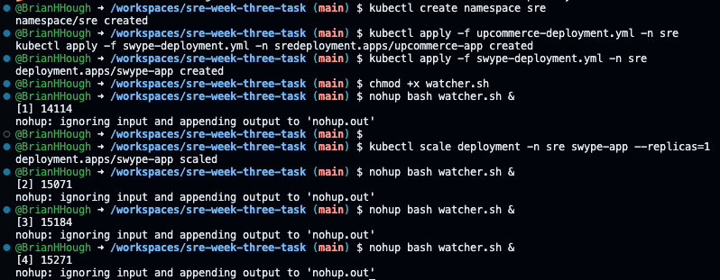
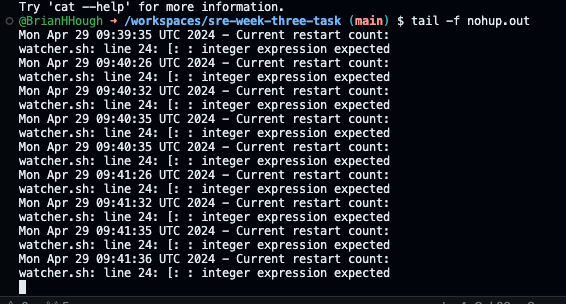

# UpCommerce

# Task 1: `watcher.sh` 
Implement a "big red button" for UpCommerce by creating a bash script to monitor the Kubernetes deployment dedicated to the Swype microservice defined in swype-deployment.yml. The script should be written in the empty watcher.sh file in the task repo, and trigger if the pod restarts due to network failure more than three times. Here's an optional, pseudocode hint of the tasks your watcher.sh file should perform:
1. Define Variables: Set the namespace, deployment name, and maximum number of restarts allowed before scaling down the deployment.
2. Start a Loop: Begin an infinite loop that will continue until explicitly broken.
3. Check Pod Restarts: Within the loop, use the kubectl get pods command to retrieve the number of restarts of the pod associated with the specified deployment in the specified namespace.
4. Display Restart Count: Print the current number of restarts to the console.
5. Check Restart Limit: Compare the current number of restarts with the maximum allowed number of restarts.
6. Scale Down if Necessary: If the number of restarts is greater than the maximum allowed, print a message to the console, scale down the deployment to zero replicas using the kubectl scale command, and break the loop.
7. Pause: If the number of restarts is not greater than the maximum allowed, pause the script for 60 seconds before the next check.
8. Repeat: After the pause, the script goes back to step 3. This process repeats indefinitely until the number of restarts exceeds the maximum allowed, at which point the deployment is scaled down and the loop is broken.

See logs output:

# Task 2: `watcher.sh` 
Identify potential solutions or products, whether free or commercial, to address the toil in the ticketing system. These solutions should aim to mitigate issues such as recurring obsolete alerts and lack of prioritization. Create a markdown file and fill these solutions in your markdown file (feel free to use your repo's README.md file for this task).

- Tool 1: Jira
    - Company Favorite (Kanban board + tagging + notifications)
- Tool 2: SalesForce
    - Similar to Jira, but with lots of development capabilities
- Tool 3: Hubspot
    - Can use the sales pipeline Kanban board
- Tool 4: Trello
    - Free tool easy for tracking Kanban boards
- Tool 5: Notion
    - Personal Favorite (Kanban board + referencing pages)